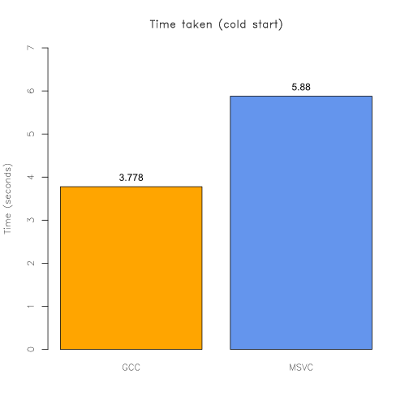
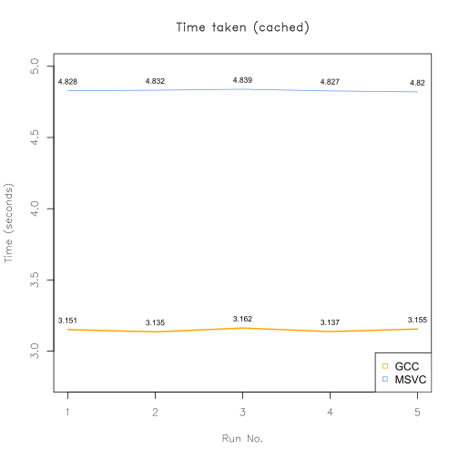

# N-body problem
Mostly single-threaded (There are some papers showing possible parallel solutions using GPUs).
See the [description](https://benchmarksgame-team.pages.debian.net/benchmarksgame/description/nbody.html "n-body description")
and the Wikipedia [article](https://en.wikipedia.org/wiki/N-body "N-body simulation")

## C implemenations
All of these are in standard C99 and don't use compiler directives.
Versions 1-3 and 4.5.1 don't use array parameter declarations, so
MSVC can compile them.

Version 4.5 seems to be the fastest right now.

Some things that didn't work:
 - Manually flattening loops by precalculating planet pairs as pairs
 of indices. This confused GCC's optimizer.
 - Adding OpenMP directives. Even though some of the loops are completely
 parallel, the program took 10x longer to finish. I only tested CPU
 multithreading, so offloading may help.
 
GCC command used:
```sh
gcc -O3 -g -Wall -Wextra -Wconversion -Wshadow -Wpointer-arith -Wvla -Werror -pedantic-errors -pipe -march=native -ffast-math -flto=auto -std=c99 -ffp-contract=fast -fmerge-all-constants -fgcse-sm -fgcse-las -fext-dce -fira-hoist-pressure -fselective-scheduling -fsel-sched-pipelining -fsel-sched-pipelining-outer-loops -fipa-reorder-for-locality -fipa-pta -ffinite-loops -fgraphite-identity -floop-nest-optimize -ftree-loop-im -ftree-loop-ivcanon -fvariable-expansion-in-unroller -fallow-store-data-races -fstdarg-opt -fopt-info-all -o nbody nbodyX.c -lm
```

MSVC (cl.exe) command used:
```cmd
cl /O2 /options:strict /W4 /utf-8 /validate-charset /MP /arch:AVX2 /fp:fast /jumptablerdata /GL /Gw /Fe:nbody /std:c17 nbodyX.c
```

### Run results
Description:
 - nbody 4.5.1
 - AMD Ryzen 5 3500U
 - gcc.exe (Rev13, Built by MSYS2 project) 15.2.0
 - MSVC 19.44.35225 (x64)
 


